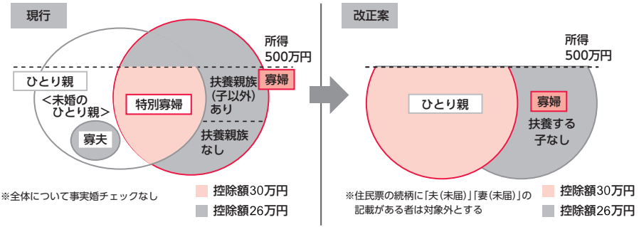

# 議案第37号 小平市税条例等の一部を改正する条例

<i class="fa fa-gavel" aria-hidden="true"></i> 総務委員会付託

本年度の国の地方税制改正、及び、国の新型コロナウイルス感染症緊急経済対策における税制上の措置による地方税法等の改正に伴い、小平市税条例等の改正を行うものです。

---

[1. 地方税制の改正に関係したもの]()
- [個人市民税に関して]()
    - [1) ひとり親家庭に対する税金の扱いを公平にするもの]()
    - [2) 個人市民税の非課税範囲の見直し]()
- [固定資産税・都市計画税に関して]()
    - [1) 使用者を所有者とみなす制度の拡大]()
    - [2) 元に所有している者の申告の制度化]()
- [市たばこ税に関して]()
- [納税環境整備に関して]()

[2. 新型コロナウイルス感染症緊急経済対策における税制上の措置関係]()

---

## 1. 地方税制の改正に関係したもの
### 個人市民税に関して
#### 1) ひとり親家庭に対する税金の扱いを公平にするもの
ひとり親に対して、「婚姻歴の有無や性別にかかわらず、全てのひとり親家庭に対して公平な税制を実現する」ことを目的としたものです。

**ア）ひとり親控除の創設**  
これまで、配偶者と離婚・死別するなどして再婚していない方のうち、所得が一定の条件に該当する方を寡婦（女性）もしくは寡夫（男性）と呼び、税控除の対象となっていました。歴史的には、戦争未亡人が、残された扶養親族等を抱えながら働くなどする場合、追加的な費用が必要であることを考慮して創設されたものだそうです。その後、社会環境の変化で見直しが行われ、現在は死別だけではなく離婚による母子家庭や父子家庭も対象になっています。しかし、以下のような問題がありました。

<fieldset>
<legend>これまでの寡婦控除・寡夫控除</legend>
<ul>
<li>未婚の場合は適用されない（ひとり親になる理由として「未婚」の率が上昇している）</li>
<li>男性のひとり親と女性のひとり親で控除の額が違う（市民税控除26万円と30万円）</li>
</fieldset>

そこで、以下のように改正するものです。
<fieldset>
<legend>改正後のひとり親控除・寡婦控除</legend>
<ul>
<li>ひとり親という区分を作成し、子どものいる寡婦・寡夫をそのくくりに入れる</li>
<li>寡夫控除を廃止する（寡婦は他にも控除があるため残す）</li>
<li>未婚のひとり親もひとり親の区分に入れ、控除を適用する</li>
<li>ひとり親の控除額は、子どものいる寡婦に対する控除で特別加算としていた金額に合わせる</li>
</ul>
</fieldset>

これで、未婚のひとり親への支援が手厚くなり、男性のひとり親も控除が増えることになり、良い改正です。ただし、一方で以下の点は厳しくなっていますので、注意が必要です。

<fieldset>
<legend>制限が厳しくなる改正点</legend>
<ul>
<li>事実婚状態にある人は（住民票の「夫（未届）」「妻（未届）」があれば）、ひとり親控除・寡婦控除の対象外にする</li>
<li>本人所得が500万円超の人に対して存在した、ひとり親控除・寡婦控除を撤廃する</li>
</fieldset>

しかし、事実婚であれば実質的に共働きであるケースが多いと考えられ、婚姻関係にある人と比べた際の公平性の観点から、問題はないと思われます。

本人所得500万円（年収換算で約700万円）の限度額を超過した人の控除がなくなることは改悪です。所得税と住民税合わせて53万円の控除がなくなり、所得税20％と考えると、実質的に年間10万円程度変わってくることになります。ここの理由は確認する必要があります。

**イ）寡婦（寡夫）控除の見直し**

#### 2) 個人市民税の非課税範囲の見直し

### 固定資産税・都市計画税に関して
#### 1) 使用者を所有者とみなす制度の拡大
#### 2) 元に所有している者の申告の制度化

### 市たばこ税に関して

### 納税環境整備に関して

## 2. 新型コロナウイルス感染症緊急経済対策における税制上の措置関係