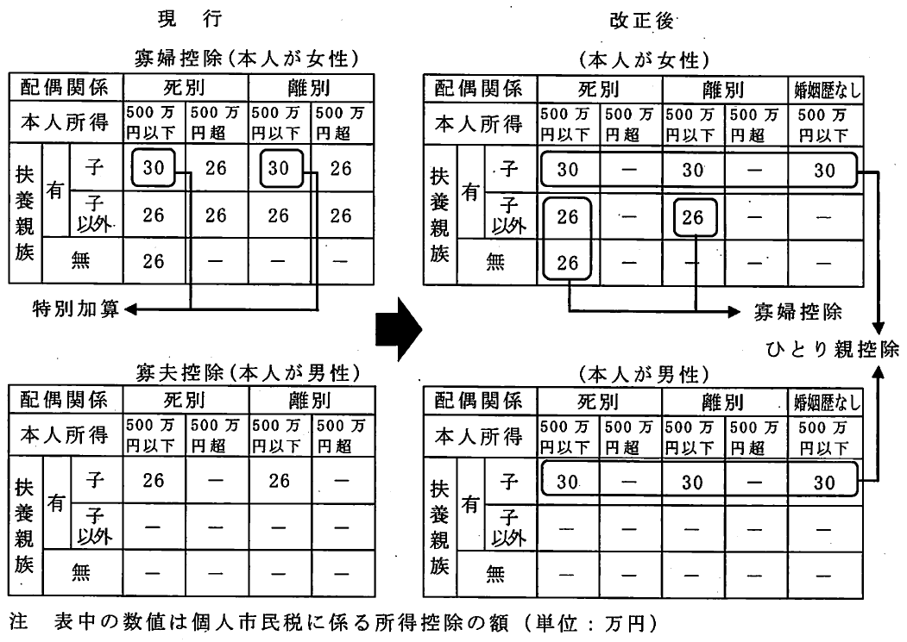

# 議案第37号 小平市税条例等の一部を改正する条例

<i class="fa fa-gavel" aria-hidden="true"></i> 総務委員会付託

<fieldset class="point">
  <legend>
    <h2 class="point"> ポイント </h2>
  </legend>
  
<i class="fa fa-check" aria-hidden="true"></i> 全てのひとり親家庭に対して公平な税制を実現するための、地方税改正に伴う条例改正

  
<i class="fa fa-check" aria-hidden="true"></i> いままでは控除対象ではなかった未婚のひとり親が控除対象に

  
<i class="fa fa-check" aria-hidden="true"></i> 寡夫と寡婦で、ひとり親の控除額が異なっていたものを統一

  
<i class="fa fa-check" aria-hidden="true"></i> ひとり親の控除は寡婦も寡夫一本化し、寡夫控除は廃止

  
<i class="fa fa-check" aria-hidden="true"></i> 所得500万円以上の寡婦に対する控除を廃止

</fieldset>

<fieldset class="sanpi">
  <legend>
    <h2 class="sanpi"> <!--<i class="fa fa-circle-o" aria-hidden="true"></i>--><i class="fa fa-question-circle-o" aria-hidden="true"></i> 私（安竹洋平）の判断：保留中 </h2>
  </legend>
  
<i class="fa fa-question-circle-o" aria-hidden="true"></i> 以下の観点から判断保留中（総務委員会質疑後決定）

  
<i class="fa fa-circle-o" aria-hidden="true"></i> 未婚のひとり親も対処とすることには賛成

  
<i class="fa fa-circle-o" aria-hidden="true"></i> 寡夫の控除額が上がり、男女の不公平が是正されることには賛成

  
<i class="fa fa-exclamation-triangle" aria-hidden="true"></i> 所得500万円以上の寡婦はどれくらいの人数がいて、どれくらい影響を受けるか

</fieldset>

## 概要

本年度の国の地方税制改正、及び、国の新型コロナウイルス感染症緊急経済対策における税制上の措置による地方税法等の改正に伴い、小平市税条例等の改正を行うものです。

---

[1. 地方税制の改正に関係したもの]()
- [個人市民税に関して]()
    - [1) ひとり親に対する税制上の措置]()
    - [2) 個人市民税の非課税範囲の見直し]()
- [固定資産税・都市計画税に関して]()
    - [1) 使用者を所有者とみなす制度の拡大]()
    - [2) 元に所有している者の申告の制度化]()
- [市たばこ税に関して]()
- [納税環境整備に関して]()

[2. 新型コロナウイルス感染症緊急経済対策における税制上の措置関係]()

---

## 1. 地方税制の改正に関係したもの
### 個人市民税に関して
#### 1) ひとり親に対する税制上の措置
ひとり親に対して、「婚姻歴の有無や性別にかかわらず、全てのひとり親家庭に対して公平な税制を実現する」ことを目的としたものです。

##### ア）ひとり親控除の創設と、イ）寡婦（寡夫）控除の見直し

これまでは、配偶者と離婚・死別するなどして再婚していない方のうち、所得が一定の条件に該当する方を寡婦（女性）もしくは寡夫（男性）と呼び、税控除の対象となっていました。歴史的には、戦争未亡人が、残された扶養親族等を抱えながら働くなどする場合、追加的な費用が必要になることを考慮して創設されたものだそうです。その後、社会環境の変化で見直しが行われ、現在は死別だけではなく、離婚による母子家庭や父子家庭も対象になっています。

しかし、以下のような問題がありました。

<fieldset>
<legend>改正前の問題点</legend>
<ul>
<li>未婚の場合は適用されない</li>
<li>男性のひとり親と女性のひとり親で控除の額が違う（市民税控除26万円と30万円）</li>
</fieldset>

これらの問題点を踏まえ、未婚のひとり親が増えているという背景もあるため、ひとり親に関する税控除に関わる税制を、以下のように改正するものです。

<fieldset>
<legend>改正後</legend>
<ul>
<li>ひとり親控除を創設し、未婚も含めて、子どものいる寡婦・寡夫をそのくくりに入れる</li>
<li>寡夫控除を廃止する（寡婦は他にも控除があるため残す）</li>
<li>ひとり親の控除額は、子どものいる寡婦に対する控除で特別加算としていた金額に合わせる</li>
</ul>
</fieldset>

ちょっと複雑ですが、未婚のひとり親への支援が手厚くなり、男性のひとり親にも控除が増えます。それらの点は良い改正だと思います。ただ一方で、以下の点は厳しくなっているので注意が必要です。

<fieldset>
<legend>改正で厳しくなる点</legend>
<ul>
<li>これまで控除対象だった事実婚の人を、ひとり親控除・寡婦控除の対象外にする</li>
<li>本人所得が500万円超の人に対する、ひとり親控除・寡婦控除は、撤廃する</li>
</fieldset>

一点目については、事実婚の人たちは実質的に共働きであるケースが多いと考えられますので、この改正は特に問題がないと思います。なお、事実婚かどうかは、住民票の「夫（未届）」「妻（未届）」で確認します。

二点目の、本人所得500万円（年収換算で約700万円）の限度額を超過した人の控除がなくなることは改悪と考えられます。該当する方は、所得税と住民税合わせて53万円の控除がなくなります。所得税率が20％と仮定すると、手取り金額は実質的に年間10万円ほど変わることになります。かなり大きな額で、子どもや扶養親族の多い世帯には負担となりますので、ここは掘り下げて検討する必要があります。

改正点を表で示すと以下のようになります。今回の小平市定例会用資料に掲載されている図です（もとの資料は会議録を参照してください）。

また、かなり分かりにくい図ですが、今回の改正点を図で示すと以下のようになります。財務省が公開している[「令和２年度税制改正（案）のポイント」（令和2年1月）](https://www.mof.go.jp/tax_policy/publication/brochure/zeiseian20/zeiseian02_01.pdf)から抜粋し、金額を住民税（市税）に直しました。実際にはこれに所得税の控除も追加されます。

#### 2) 個人市民税の非課税範囲の見直し

現在、合計所得金額が135万円以下の寡夫、寡婦、単身児童扶養者等は非課税です。今回、上記の通り寡夫控除が撤廃され、ひとり親控除が創設されたことにより、非課税の対象を寡夫からひとり親へ変更します。

### 固定資産税・都市計画税に関して

#### 1) 使用者を所有者とみなす制度の拡大
固定資産の所有者の所在が、震災等の事由によって不明である場合に、その固定資産の使用者を所有者とみなして課税することができる既存の制度を拡大し、事由を問わず、市が調査を尽くしても、なお、その所有者が明らかとならない場合は、事前に通知した上で、使用者を所有者とみなして課税することができる制度を創設するものです。

土地や家屋を使用収益しているものがいるにもかかわらず、「現に所有している者」が特定できない場合があるそうです。そのような場合には固定資産税を徴収できず、税の公平性の観点で問題が生じるための措置とのことです。

小平市には該当する土地はないとのこと。

#### 2) 現に所有している者の申告の制度化
固定資産の登記簿上の所有者が死亡し、相続登記がされるまでの間において、その固定資産を現に所有している相続人等に対し、氏名、住所等必要な事項を申告させる制度を創設するものです。

所有者不明の土地が増えていることに対応するため、とのことです。固定資産税の徴収につなげる目的もあるのでしょう。

### 市たばこ税に関して

現在、国のたばこ税と同様に、重量に応じて課税されている軽量なはまきかみまき・葉巻たばこについて、紙巻たばこと同等の税負担となるよう、課税方式を段階的に見直すもの。

第三種のビールのように、課税したい側とされたくない側のいたちごっこですね。

私はたばこを吸いません。ただし、たばこは嗜好品と思っているため、煙害がなければ、吸うことは本人の自由だと思います。たばこ税に関しては「喫煙者は肺の病気になりやすいから、健康保険料の受益分があり、その補償だ」というそれらしい話もあります。本当なのでしょうか。

### 納税環境整備に関して
法人市民税の納期限の延長の適用を受けた場合の延滞金の割合について、財務大臣が告示する割合に加算する割合を、現行の年1.0 %から年0.5%に引き下げるものです。

新型コロナウイルス感染症に関するものではなく、市中金利の実勢を踏まえたもの。

## 2. 新型コロナウイルス感染症緊急経済対策における税制上の措置関係
### 個人市民税に関して
#### 1) 寄附金税額控除の特例

新型コロナウイルス感染症等の影響により、中止等をしたイベントの、入場料金等の払い戻しを請求する権利を放棄した場合には、その放棄した金額に相当する金額を、20万円を限度として寄附金税額控除の対象とする制度を創設するもの。

#### 2) 住宅借入金等特別税額控除（住宅ローン控除）の適用要件の弾力化
① 新型コロナウイルス感染症等の影響に対応するための国税関係法律の臨時特例
に関する法律の措置内容

② ①の措置に合わせた小平市税条例の規定整備

## 質疑
### 於 5/21 一人会派の会への会派説明時
Q: 寡婦控除、寡夫控除、なぜ二つに分ける必要が？
> 歴史的な経緯から（寡婦については上記の通り）。

Q: 所有者なしの土地に関して小平市は？
> 所有者が不明で使用者がいる土地というのは小平市にはない。使用者がなく所有者もなしの土地はある。小さい土地はお金がかかるのでそのままにしておく。

Q: 小平市では土地に使用者が勝手に入ってくることはあるか？
> そういうケースはないが、今まで賃料を払って使用していた人がいる土地で、所有者が亡くなったために支払えなくなり結果としてお金を払わずに使用しているケースはある。

Q: 法人市民税の延滞金加算割合が年1.0%から0.5%に引き下げるのは新型コロナウイルス感染症の影響ではなく、市場金利に合わせるものか？
> そういうこと。国の方で加算割合を下げた。

Q: 寄付金控除はどうやって証明するか？
> 対象となるイベントは決め打ち。イベント主催者が証明書を発行し、控除を受ける人はその証明書をつけて確定申告する。

### 於 6/2 本会議

### 於 6/9 総務委員会