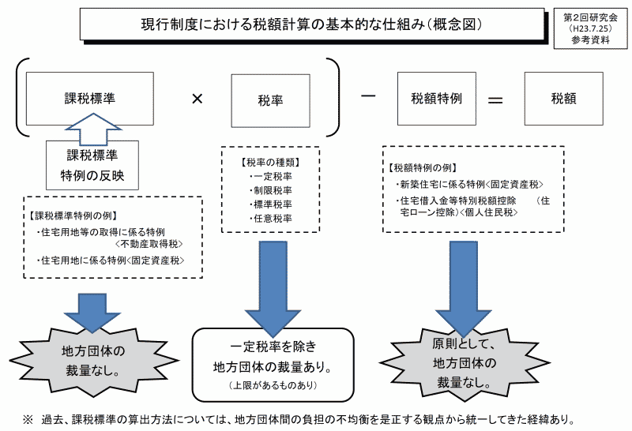
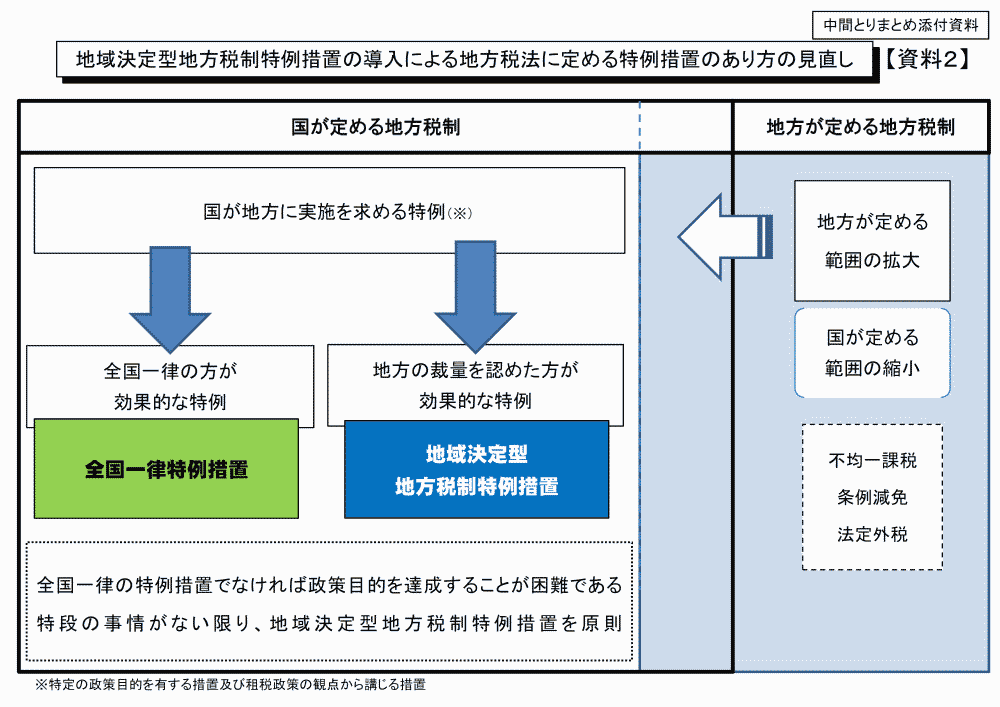
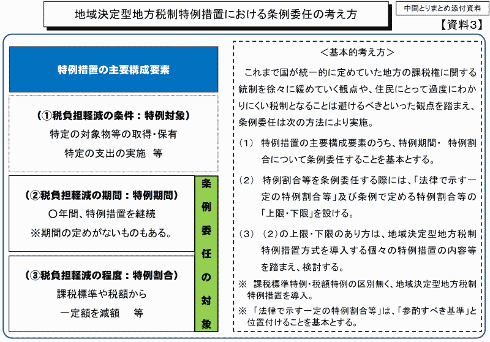

# 議案第37号 小平市税条例等の一部を改正する条例

<i class="fa fa-gavel" aria-hidden="true"></i> 総務委員会付託

<fieldset class="point">
  <legend>
    <h2 class="point"> ポイント </h2>
  </legend>
  
（本年度の地方税制の改正に伴うもの）

  
<i class="fa fa-check" aria-hidden="true"></i> 全てのひとり親家庭に対して公平な税制を実現するための、地方税改正に伴う条例改正

  
　<i class="fa fa-check" aria-hidden="true"></i> ひとり親の控除は寡婦も寡夫一本化し、寡夫控除は廃止

  
　<i class="fa fa-check" aria-hidden="true"></i> 本人所得500万円未満のひとり親控除のうち、未婚が対象、事実婚が非対称になる

  
　<i class="fa fa-check" aria-hidden="true"></i> 本人所得500万円以上の寡婦に対する控除が撤廃される

  
<i class="fa fa-check" aria-hidden="true"></i> 土地や家屋を所有せず使用しているだけの人にも、固定資産税を課税できるようにする

  
<i class="fa fa-check" aria-hidden="true"></i> 所有者不明の土地が増えていることに対応するため、固定資産所有者に申告を義務付ける

  
<i class="fa fa-check" aria-hidden="true"></i> 軽量な葉巻たばこについて、紙巻たばこと同等になるよう段階的に税率変更する

  
<i class="fa fa-check" aria-hidden="true"></i> 市税の延滞金を計算する際に使われる割合の数値を1%から0.5%に引き下げる

  
（新型コロナウイルス感染症への緊急経済対策としての税制上の措置）

  
<i class="fa fa-check" aria-hidden="true"></i> 中止等したイベントの入場料等を寄附金税額控除に

  
<i class="fa fa-check" aria-hidden="true"></i> 入居が遅れた場合でも住宅ローン控除期間を延長する

  
<i class="fa fa-check" aria-hidden="true"></i> 中小事業者の新規設備投資に対する固定資産税を3年度間ゼロに

  
<i class="fa fa-check" aria-hidden="true"></i> 消費税引き上げへの対応で適用している軽自動車税環境性能割の税率低減期間を6か月延長

  
<i class="fa fa-check" aria-hidden="true"></i> 収入が減って納税が困難になった事業者等に対し、1年間無担保・無延滞金で徴収を猶予

</fieldset>

<fieldset class="sanpi">
  <legend>
    <h2 class="sanpi"> <!--<i class="fa fa-circle-o" aria-hidden="true"></i>--><i class="fa fa-question-circle-o" aria-hidden="true"></i> 私（安竹洋平）の判断：保留中 </h2>
  </legend>
  
<i class="fa fa-question-circle-o" aria-hidden="true"></i> 以下の観点から判断保留中（総務委員会質疑後決定）

  
<i class="fa fa-circle-o" aria-hidden="true"></i> 未婚のひとり親も対処とすることには賛成

  
<i class="fa fa-circle-o" aria-hidden="true"></i> 寡夫の控除額が上がり、男女の不公平が是正されることには賛成

  
<i class="fa fa-exclamation-triangle" aria-hidden="true"></i> 所得500万円以上の寡婦はどれくらいの人数がいて、どれくらい影響を受けるか

</fieldset>

## 概要

本年度の国の地方税制改正、及び、国の新型コロナウイルス感染症緊急経済対策における税制上の措置による地方税法等の改正に伴い、小平市税条例等の改正を行うものです。

---

[1. 地方税制の改正に関係したもの](#1-地方税制の改正に関係したもの)
- [個人市民税に関して](#個人市民税に関して)
  - [1) ひとり親に対する税制上の措置](#1-ひとり親に対する税制上の措置)
  - [2) 個人市民税の非課税範囲の見直し](#2-個人市民税の非課税範囲の見直し)
- [固定資産税・都市計画税に関して](#固定資産税都市計画税に関して)
  - [1) 使用者を所有者とみなす制度の拡大](#1-使用者を所有者とみなす制度の拡大)
  - [2) 元に所有している者の申告の制度化](#2-現に所有している者の申告の制度化)
- [市たばこ税に関して](#市たばこ税に関して)
- [納税環境整備に関して](#納税環境整備に関して)

[2. 新型コロナウイルス感染症緊急経済対策における税制上の措置関係](#2-新型コロナウイルス感染症緊急経済対策における税制上の措置関係)
- [個人市民税に関して](#個人市民税に関して-1)
  - [1) 寄附金税額控除の特例](#1-寄附金税額控除の特例)
  - [2) 住宅借入金等特別税額控除（住宅ローン控除）の適用要件の弾力化](#2-住宅借入金等特別税額控除住宅ローン控除の適用要件の弾力化)
- [固定資産税に関して](#固定資産税に関して)
  - [地域決定型地方税制特例措置（わがまち特例）の拡充](#地域決定型地方税制特例措置わがまち特例の拡充)
- [軽自動車税に関して](#軽自動車税に関して)
- [納税環境整備に関して](#納税環境整備に関して-1)
- [新型コロナウイルス感染症等に係る徴収猶予の特例に係る手続](#新型コロナウイルス感染症等に係る徴収猶予の特例に係る手続)

---

## 解説
{{#include ../partials/yasutake-speak.md:1}} 今回最も分かりにくいのが、ひとり親に対する税制上の措置に関してです。簡単に羅列すると以下のようになります。
- ひとり親は生活が大変なので、市税（住民税）を控除する仕組みがある。国の方では所得税を控除する仕組みがある
- これまでも「寡婦控除」「寡夫控除」として、ひとり親に対する控除はあった。しかし男女で控除額が異なるなど不公平であった
- 未婚のひとり親は「寡婦控除」の対象外であった
- 上記課題を解決するため、ひとり親控除を新設し、寡夫控除と寡婦控除のひとり親に関する部分をひとまとめにする
- 寡夫控除はひとり親控除に移行して要らなくなるため廃止
- 寡婦控除はひとり親控除以外にも控除対象となるものがあるため残す
- これまで事実婚は控除対象だったが、はずす
- これまで本人所得500万円以上の方に対しても控除があったが、それを撤廃する

その他の条例改正も含めて、詳しくは下に記しました。

それにしても、改正項目が多く、これをひとつの議案として扱っていいものかは疑問があるところです。

### 1. 地方税制の改正に関係したもの
#### 個人市民税に関して
##### 1) ひとり親に対する税制上の措置
ひとり親に対して、「婚姻歴の有無や性別にかかわらず、全てのひとり親家庭に対して公平な税制を実現する」ことを目的としたものです。

###### ひとり親控除の創設と寡婦（寡夫）控除の見直し

これまでは、配偶者と離婚・死別するなどして再婚していない方のうち、所得が一定の条件に該当する方を寡婦（女性）もしくは寡夫（男性）と呼び、税控除の対象となっていました。歴史的には、戦争未亡人が、残された扶養親族等を抱えながら働くなどする場合、追加的な費用が必要になることを考慮して創設されたものだそうです。その後、社会環境の変化で見直しが行われ、現在は死別だけではなく、離婚による母子家庭や父子家庭も対象になっています。

しかし、以下のような問題がありました。

<fieldset>
<legend>改正前の問題点</legend>
<ul>
<li>未婚の場合は適用されない</li>
<li>男性のひとり親と女性のひとり親で控除の額が違う（市民税控除26万円と30万円）</li>
</fieldset>

これらの問題点を踏まえ、未婚のひとり親が増えているという背景もあるため、ひとり親に関する税控除に関わる税制を、以下のように改正するものです。

<fieldset>
<legend>改正後</legend>
<ul>
<li>ひとり親控除を創設し、未婚も含めて、子どものいる寡婦・寡夫をそのくくりに入れる</li>
<li>寡夫控除を廃止する（寡婦は他にも控除があるため残す）</li>
<li>ひとり親の控除額は、子どものいる寡婦に対する控除で特別加算としていた金額に合わせる</li>
</ul>
</fieldset>

ちょっと複雑ですが、未婚のひとり親への支援が手厚くなり、男性のひとり親にも控除が増えます。それらの点は良い改正だと思います。ただ一方で、以下の点は厳しくなっているので注意が必要です。

<fieldset>
<legend>改正で厳しくなる点</legend>
<ul>
<li>これまで控除対象だった事実婚の人を、ひとり親控除・寡婦控除の対象外にする</li>
<li>本人所得が500万円超の人に対する、ひとり親控除・寡婦控除は、撤廃する</li>
</fieldset>

一点目については、事実婚の人たちは実質的に共働きであるケースが多いと考えられますので、この改正は特に問題がないと思います。なお、事実婚かどうかは、住民票の「夫（未届）」「妻（未届）」で確認します。

二点目の、本人所得500万円（年収換算で約700万円）の限度額を超過した人の控除がなくなることは改悪と考えられます。該当する方は、所得税と住民税合わせて53万円の控除がなくなります。所得税率が20％と仮定すると、手取り金額は実質的に年間10万円ほど変わることになります。かなり大きな額で、子どもや扶養親族の多い世帯には負担となりますので、ここは掘り下げて検討する必要があります。

改正点を表で示すと以下のようになります。今回の小平市定例会用資料に掲載されている図です（もとの資料は会議録を参照してください）。

また、かなり分かりにくい図ですが、今回の改正点を図で示すと以下のようになります。財務省が公開している[「令和２年度税制改正（案）のポイント」（令和2年1月）](https://www.mof.go.jp/tax_policy/publication/brochure/zeiseian20/zeiseian02_01.pdf)から抜粋し、金額を住民税（市税）に直しました。実際にはこれに所得税の控除も追加されます。

<table class="additional">
    <thead>
      <tr>
        <td colspan=2>影響額・施行期日等</td>
      </tr>
    </thead>
    <tr>
        <td>適用</td>
        <td>令和3年度分以降の個人市民税について適用</td>
    </tr>
    <tr>
        <td>影響額</td>
        <td>影響額の試算は困難</td>
    </tr>
    <tr>
        <td>該当条項</td>
        <td><a href="https://www.city.kodaira.tokyo.jp/reiki/reiki_honbun/g135RG00000170.html#e000001322">小平市税条例 第25条の3（所得控除）</a></td>
    </tr>
    <tr>
        <td>施行期日</td>
        <td>令和3年1月1日</td>
    </tr>
</table>

##### 2) 個人市民税の非課税範囲の見直し

現在、合計所得金額が135万円以下の寡夫、寡婦、単身児童扶養者等は非課税です。今回、上記の通り寡夫控除が撤廃され、ひとり親控除が創設されたことにより、非課税の対象を寡夫からひとり親へ変更します。

<table class="additional">
    <thead>
      <tr>
        <td colspan=2>影響額・施行期日等</td>
      </tr>
    </thead>
    <tr>
        <td>適用</td>
        <td>令和3年度分以降の個人市民税について適用</td>
    </tr>
    <tr>
        <td>影響額</td>
        <td>影響額の試算は困難</td>
    </tr>
    <tr>
        <td>該当条項</td>
        <td><a href="https://www.city.kodaira.tokyo.jp/reiki/reiki_honbun/g135RG00000170.html#e000001080">小平市税条例 第16条（個人の市民税の非課税の範囲）</a></td>
    </tr>
    <tr>
        <td>施行期日</td>
        <td>令和3年1月1日</td>
    </tr>
</table>

#### 固定資産税・都市計画税に関して

##### 1) 使用者を所有者とみなす制度の拡大
固定資産の所有者の所在が、震災等の事由によって不明である場合に、その固定資産の使用者を所有者とみなして課税することができる既存の制度を拡大し、事由を問わず、市が調査を尽くしても、なお、その所有者が明らかとならない場合は、事前に通知した上で、使用者を所有者とみなして課税することができる制度を創設するものです。

土地や家屋を使用収益しているものがいるにもかかわらず、「現に所有している者」が特定できない場合があるそうです。そのような場合には固定資産税を徴収できず、税の公平性の観点で問題が生じるための措置とのことです。

小平市には該当する土地はないとのことです。

<table class="additional">
    <thead>
      <tr>
        <td colspan=2>影響額・施行期日等</td>
      </tr>
    </thead>
    <tr>
        <td>適用</td>
        <td>令和3年度分以降の固定資産税・都市計画税について適用</td>
    </tr>
    <tr>
        <td>影響額</td>
        <td>影響なし</td>
    </tr>
    <tr>
        <td>該当条項</td>
        <td><a href="https://www.city.kodaira.tokyo.jp/reiki/reiki_honbun/g135RG00000170.html#e000002493">小平市税条例 第33条（固定資産税の納税義務者等）</a></td>
    </tr>
    <tr>
        <td>施行期日</td>
        <td>公布の日</td>
    </tr>
</table>

##### 2) 現に所有している者の申告の制度化
固定資産の登記簿上の所有者が死亡し、相続登記がされるまでの間において、その固定資産を現に所有している相続人等に対し、氏名、住所等必要な事項を申告させる制度を創設するものです。

所有者不明の土地が増えていることに対応するため、とのことです。固定資産税の徴収率向上につなげる目的もあるのでしょう。申告がなかった場合は10万円以下の過料を科すこともできるようになっています。小平市の場合、これまでも、所有者のいる固定資産については未申告の場合に過料を科すことができるとされていました。今回の改正で、所有者がいなくても、相続登記ができるまでの間の固定資産に関して、申告がなかった際の過料を科すことができることになります。

<table class="additional">
    <thead>
      <tr>
        <td colspan=2>影響額・施行期日等</td>
      </tr>
    </thead>
    <tr>
        <td>適用</td>
        <td>改正条例の施行の日以降の固定資産税・都市計画税について適用</td>
    </tr>
    <tr>
        <td>影響額</td>
        <td>影響なし</td>
    </tr>
    <tr>
        <td>該当条項</td>
        <td><a href="https://www.city.kodaira.tokyo.jp/reiki/reiki_honbun/g135RG00000170.html#e000003124">小平市税条例 第49条の3（住宅用地の申告）</a></td>
    </tr>
    <tr>
        <td>施行期日</td>
        <td>公布の日</td>
    </tr>
</table>

#### 市たばこ税に関して

現在、国のたばこ税と同様に、重量に応じて課税されている軽量な葉巻たばこについて、紙巻たばこと同等の税負担となるよう、課税方式を段階的に見直すもの。

第三種のビールのように、課税したい側とされたくない側のいたちごっこですね。

<table class="additional">
    <thead>
      <tr>
        <td colspan=2>影響額・施行期日等</td>
      </tr>
    </thead>
    <tr>
        <td>適用</td>
        <td>第1段階：令和2年10月1日以後に売り渡される葉巻たばこについて適用 第2段階：令和3年10月1日以後に売り渡される葉巻たばこについて適用
        </td>
    </tr>
    <tr>
        <td>影響額</td>
        <td>影響額の試算は困難</td>
    </tr>
    <tr>
        <td>該当条項</td>
        <td><a href="https://www.city.kodaira.tokyo.jp/reiki/reiki_honbun/g135RG00000170.html#e000003794">小平市税条例 第68条（たばこ税の課税標準）</a></td>
    </tr>
    <tr>
        <td>施行期日</td>
        <td>令和2年10月1日</td>
    </tr>
</table>

#### 納税環境整備に関して
法人市民税の納期限の延長の適用を受けた場合の延滞金の割合について、財務大臣が告示する割合に加算する割合を、現行の年1.0 %から年0.5%に引き下げるものです。令和3年1月1日以降の延滞金に適用されます。

財務大臣が告示する割合というのは「[特例基準割合](https://ja.wikipedia.org/wiki/%E7%89%B9%E4%BE%8B%E5%9F%BA%E6%BA%96%E5%89%B2%E5%90%88)」といわれているもので、国税の延滞税、利子税や地方税等の延滞金、還付加算金の算出に使用される数値のことです。この特例基準割合は市中金利の低下に伴って毎年のように見直されています。令和2年12月末までは特例基準割合は1.6%です。

市民税の場合、納期限の翌日から1か月が過ぎるまでの延滞金の割合と、納期限の翌日から1か月を過ぎて以降の延滞金の割合が異なります。以下の表のようになっています。

<table>
    <thead>
    <tr>
        <td></td>
        <td>本則の割合</td>
        <td>特例の割合</td>
        <td>令和2年中の割合 （特例基準割合=1.6%）</td>
    </tr>
    </thead>
    <tr>
        <td>納期限の翌日から 1か月を経過する日まで</td>
        <td>年7.3％</td>
        <td>特例基準割合＋1％</td>
        <td>2.60%</td>
    </tr>
    <tr>
        <td>納期限の翌日から 1か月を経過した日以降</td>
        <td>年14.6％</td>
        <td>特例基準割合＋7.3％</td>
        <td>8.90%</td>
    </tr>
</table>

令和3年1月1日から、特例基準割合は不明ですが、上記加算分1%のところが0.5%になります。7.3%の部分は変更が無いようです。年7.3%が加算されるとなると、かなりの利率ですね。

ちなみに、還付加算金も特例基準割合を使用して計算されると書いてあったため、もしかすると還付金にも年7.3%分加算されるのか？！と思ったのですが（期待することではありませんが（笑））、こちらの還付金に関しては、特例基準割合そのもの（令和2年中は1.6%）で計算するそうで加算分はないということです。

[延滞金及び還付加算金の割合（小平市）](https://www.city.kodaira.tokyo.jp/kurashi/036/036989.html)

なお、この改正は新型コロナウイルス感染症に関するものではなく、市中金利の実勢を踏まえたものです。

<table class="additional">
    <thead>
      <tr>
        <td colspan=2>影響額・施行期日等</td>
      </tr>
    </thead>
    <tr>
        <td>適用</td>
        <td>令和3年1月1日以降の延滞金について適用</td>
    </tr>
    <tr>
        <td>影響額</td>
        <td>影響額の試算は困難</td>
    </tr>
    <tr>
        <td>該当条項</td>
        <td><a href="https://www.city.kodaira.tokyo.jp/reiki/reiki_honbun/g135RG00000170.html#e000004619">小平市税条例 附則第5条（延滞金の割合等の特例） 附則第5条の2（納期限の延長に係る延滞金の特例）</a></td>
    </tr>
    <tr>
        <td>施行期日</td>
        <td>令和3年1月1日</td>
    </tr>
</table>

### 2. 新型コロナウイルス感染症緊急経済対策における税制上の措置関係
#### 個人市民税に関して
##### 1) 寄附金税額控除の特例
新型コロナウイルス感染症等の影響により、中止等をしたイベントの、入場料金等の払い戻しを請求する権利を放棄した場合には、その放棄した金額に相当する金額を、20万円を限度として寄附金税額控除の対象とする制度を創設するものです。

<table class="additional">
    <thead>
      <tr>
        <td colspan=2>影響額・施行期日等</td>
      </tr>
    </thead>
    <tr>
        <td>適用</td>
        <td>令和2年2月1日から令和3年1月3 1日までの間に開催予定であったイベントに係る入場料金等払戻請求権を令和2年2月1日から令和3年12月3 1日までの間に放棄した場合に適用</td>
    </tr>
    <tr>
        <td>影響額</td>
        <td>影響額の試算は困難</td>
    </tr>
    <tr>
        <td>該当条項</td>
        <td><a href="https://www.city.kodaira.tokyo.jp/reiki/reiki_honbun/g135RG00000170.html">小平市税条例 附則第26条（新型コロナウイルス感染症等に係る寄附金税額控除の特例）</a></td>
    </tr>
    <tr>
        <td>施行期日</td>
        <td>令和3年1月1日</td>
    </tr>
</table>

##### 2) 住宅借入金等特別税額控除（住宅ローン控除）の適用要件の弾力化
所得税における住宅ローン控除に関して、消費税率引き上げに伴う対応として、令和2年12月31日までに入居した場合に適用する住宅ローン控除の控除期間を13年間とする等の特例措置について、新型コロナウイルス感染症等の影響により入居が遅れた場合には、その入居期限を令和3年12月31日まで延長する等の措置が講じられたことに伴い、小平市税条例の関係規定の整備を行うものです。

この期間延長が適用となるためには、次の要件を満たす必要があります。

ア）注文住宅を新築する場合は令和2年9月30日まで、分譲住宅及び既存住宅を取得する場合並びに増改築等をする場合は令和2年1 1月30日までに、それぞれ当該住宅取得等に係る契約が締結されていること。

イ）新型コロナウイルス感染症及びそのまん延防止のための措置の影響を受けたため、令和2年12月31日までに入居できなかった場合であること。

<table class="additional">
    <thead>
      <tr>
        <td colspan=2>影響額・施行期日等</td>
      </tr>
    </thead>
    <tr>
        <td>適用</td>
        <td>住宅ローン控除の控除期間を1 3年間とする等の特例措置の対象者が、新型コロナウイルス感染症等の影響により令和2年12月31日までに入居できず、契約日の要件を満たし、令和3年12月31日までの間に入居した場合に適用</td>
    </tr>
    <tr>
        <td>影響額</td>
        <td>影響額の試算は困難</td>
    </tr>
    <tr>
        <td>該当条項</td>
        <td><a href="https://www.city.kodaira.tokyo.jp/reiki/reiki_honbun/g135RG00000170.html">小平市税条例 附則第27条（新型コロナウイルス感染症等に係る住宅借入金等特別税額控除の特例）</a></td>
    </tr>
    <tr>
        <td>施行期日</td>
        <td>令和3年1月1日</td>
    </tr>
</table>

#### 固定資産税に関して
##### 地域決定型地方税制特例措置（わがまち特例）の拡充
新型コロナウイルス感染症等の影響を受けながらも新規に設備投資を行う中小事業者等を支援するため、地方税法において、いわゆるわがまち特例の適用対象に、中小事業者等が一定の期間内に認定先端設備等導入計画に従って取得をした事業用の家屋と構築物が追加されました。それを受けて、小平市税条例においては、これらの固定資産税の課税標準を最初の3年度間0とする規定を追加するものです。

対象資産：中小事業者等が、令和2年4月30日から令和3年3月31日までの間に、「生産性向上特別措置法」に規定されている「認定先端設備等導入計画」に従って取得をした先端設備等、事業に使う一定の家屋及び構築物

なお「一定の家屋及び構築物」とは、取得価額が120万円以上であり、商品の生産、販売、サービスに直接使用する家屋及び構築物のことです。

固定資産税が課されることになった年度から3年度間は、固定資産税の課税標準（課税の対象となる金額）がゼロになります（つまり固定資産税がゼロとなる）。

###### 地域決定型地方税制特例措置（わがまち特例）とは

わがまち特例というのは、地方税の特例措置について、国が一律に定めていた内容を市町村が判断し、条例で決定できる仕組みのことです。

[わがまち特例（総務省）](https://www.soumu.go.jp/main_content/000167279.pdf)

[わがまち特例とは（厚木市）](https://www.city.atsugi.kanagawa.jp/shiminbenri/totokezei/zei/kotei/shokyaku/d023485.html)

税額は以下のように決まります。このとき、課税標準特例と税額特例の部分に地方自治体の裁量を増やそうというのがわがまち特例の仕組みのようです。以下の図は[わがまち特例（総務省）](https://www.soumu.go.jp/main_content/000167279.pdf)より。

<table class="additional">
    <thead>
      <tr>
        <td colspan=2>影響額・施行期日等</td>
      </tr>
    </thead>
    <tr>
        <td>適用</td>
        <td>令和3年度分以降の固定資産税について適用</td>
    </tr>
    <tr>
        <td>影響額</td>
        <td>影響額の試算は困難</td>
    </tr>
    <tr>
        <td>該当条項</td>
        <td><a href="https://www.city.kodaira.tokyo.jp/reiki/reiki_honbun/g135RG00000170.html#e000004619">小平市税 附則第10条の2（法附則第15条第2項第1号等の条例で定める割合）</a></td>
    </tr>
    <tr>
        <td>施行期日</td>
        <td>公布の日</td>
    </tr>
</table>

#### 軽自動車税に関して
消費税率引き上げに伴う対応として、令和元年10月1日から令和2年9月30日までの間に取得した自家用乗用車について適用している環境性能割の税率を1%のものは非課税に、2%のものは1%に軽減する特例措置の適用期限を6か月延長し、令和3年3月31日までの間に取得した自家用乗用車について適用する。

<table class="additional">
    <thead>
      <tr>
        <td colspan=2>影響額・施行期日等</td>
      </tr>
    </thead>
    <tr>
        <td>適用</td>
        <td>令和2年10月1日から令和3年3月31日までの間に取得した自家用乗用車について適用</td>
    </tr>
    <tr>
        <td>影響額</td>
        <td>令和2年度：約110万円の減収 令和3年度：約55万円の減収 いずれも令和2年度当初予算ベースで試算</td>
    </tr>
    <tr>
        <td>該当条項</td>
        <td><a href="https://www.city.kodaira.tokyo.jp/reiki/reiki_honbun/g135RG00000170.html#e000004619">小平市税条例 附則第15条の2（軽自動車税の環境性能割の非課税）</a></td>
    </tr>
    <tr>
        <td>施行期日</td>
        <td>公布の日</td>
    </tr>
</table>

#### 納税環境整備に関して
##### 新型コロナウイルス感染症等に係る徴収猶予の特例に係る手続
地方税法において、新型コロナウイルス感染症等の影響により、収入が大幅に減少し、納税することが困難となった事業者等に対し、無担保かつ延滞金なしで1年間徴収を猶予することができる特例措置が講じられたことに伴い、小平市税条例において、当該特例措置の手続に関する規定の整備を行うものです。

<table class="additional">
    <thead>
      <tr>
        <td colspan=2>影響額・施行期日等</td>
      </tr>
    </thead>
    <tr>
        <td>適用</td>
        <td>令和2年2月1日から令和3年1月31日までに納期限が到来する市税について適用</td>
    </tr>
    <tr>
        <td>影響額</td>
        <td>影響なし</td>
    </tr>
    <tr>
        <td>該当条項</td>
        <td>小平市税条例 附則第25条（新型コロナウイルス感染症等に係る徴収猶予の特例に係る手続）</td>
    </tr>
    <tr>
        <td>施行期日</td>
        <td>公布の日</td>
    </tr>
</table>

## 主な質疑
{{#include ../partials/situgi_hanrei.md}}

### ＠ 5月21日 一人会派の会への会派説明時
<table class="qanda"><tr><td><i class="fa fa-question-circle hitori" aria-label="一人会派の会 他の議員による質問"></i></td><td>
寡婦控除、寡夫控除、なぜ二つに分ける必要が？
</td></tr></table>

> 歴史的な経緯から（寡婦については上記の通り）。

 
<table class="qanda"><tr><td><i class="fa fa-question-circle hitori yasutake" aria-label="安竹洋平による質問"></i></td><td>
所有者なしの土地に関して、小平市は？（安竹 洋平）
</td></tr></table>

> 所有者が不明で使用者がいる土地は、小平市にはない。使用者がなく所有者もなしの土地はある。小さい土地はお金がかかるのでそのままにしておく。

 
<table class="qanda"><tr><td><i class="fa fa-question-circle hitori yasutake" aria-label="安竹洋平による質問"></i></td><td>
小平市では土地に使用者が勝手に入ってくることはあるか？（安竹 洋平）
</td></tr></table>

> そういうケースはないが、今まで賃料を払って使用していた人がいる土地で、所有者が亡くなったために支払えなくなり結果としてお金を払わずに使用しているケースはある。

 
<table class="qanda"><tr><td><i class="fa fa-question-circle hitori yasutake" aria-label="安竹洋平による質問"></i></td><td>
法人市民税の延滞金加算割合が年1.0%から0.5%に引き下げるのは新型コロナウイルス感染症の影響ではなく、市場金利に合わせるものか？（安竹 洋平）
</td></tr></table>

> そういうこと。国の方で加算割合を下げた。

 
<table class="qanda"><tr><td><i class="fa fa-question-circle hitori yasutake" aria-label="安竹洋平による質問"></i></td><td>
寄付金控除はどうやって証明するか？（安竹 洋平）
</td></tr></table>

> 対象となるイベントは決め打ち。イベント主催者が証明書を発行し、控除を受ける人はその証明書をつけて確定申告する。

### ＠ 6月2日 本会議
<a href="../honkaigi-situmon-mondai.md"><i class="fa fa-exclamation-triangle" aria-hidden="true" style="color:red;"></i> 本会議における質問ルールと問題点</a> 

 
<table class="qanda"><tr><td><i class="fa fa-question-circle hitori yasutake" aria-label="安竹洋平による質問"></i></td><td>
ひとり親控除について、影響額を見積れない理由は。未婚のひとり親の人数が分かっていないからか、事実婚の調査が終わらないからか。（安竹 洋平）
</td></tr></table>

> 婚姻歴のないひとり親に該当する対象者数の把握が困難なため。（柳瀨 市民部長）

 
<table class="qanda"><tr><td><i class="fa fa-question-circle hitori yasutake" aria-label="安竹洋平による質問"></i></td><td>
ひとり親控除について、影響額として、市の財政にはプラス・マイナスどちらになるか（といった概算）も分からないか。（安竹 洋平）
</td></tr></table>

> 市の財政には、寡夫に関しては約30万円程度の減収、500万円を超える部分の撤廃に関しては、約190万円ほどの歳入の増を見込んでいる。全体としては、婚姻歴のないひとり親の人数把握が困難なため不明。（柳瀨）

 
<table class="qanda"><tr><td><i class="fa fa-question-circle hitori yasutake" aria-label="安竹洋平による質問"></i></td><td>
ひとり親控除について、これまであった本人所得が500万円を超える場合の控除が撤廃される。市民税26万円プラス所得税27万円、合計53万円の控除が撤廃になる。人によっては影響が大きいのでは。市としてはどう考えているか。（安竹 洋平）
</td></tr></table>

> 500万円を超える人にとっては増税、寡夫については今回ひとり親控除に組み込まれるため控除額が増えるため減税となる。全体としての改正内容の結果であり、多いか少ないかについては答えが難しい。（柳瀨）

 
<table class="qanda"><tr><td><i class="fa fa-question-circle hitori yasutake" aria-label="安竹洋平による質問"></i></td><td>
ひとり親控除について、これまであった、寡婦に対する控除（ひとり親とは関係ない部分）もなくなってしまう。人によっては影響が大きいのではないか。（市は該当する人たちの状況を）把握していないということで良いか。（安竹 洋平）
</td></tr></table>

> 給与収入だと６７８万円、ほとんどの方がその範囲内、該当者には影響がないと考える。（柳瀨）

{{#include ../partials/yasutake-speak.md:1}} これは委員会に付託する議案ですので、残念ながら本会議においてはこれ以上踏み込んだ質問ができません。あとの細かいことに関する質問は橋本久雄委員に託しました。

### ＠ 6月9日 総務委員会
{{#include ../partials/yasutake-speak.md:1}} 総務委員会には、一人会派の会から橋本久雄議員が委員として参加しています。

#### 1) ひとり親控除について

<table class="qanda"><tr><td><i class="fa fa-question-circle-o" aria-label="その他議員による質問"></i></td><td>
本会議の再確認として、市が増収になる税額はどれくらいか。
</td></tr></table>

> 合計所得が500万円超の寡婦については、今後控除がなくなり、一人当たり15,600円の負担増（増税）になる。対象者は約120人おり、市税への影響額は合計約190万円の増収。一方、寡夫については、今後ひとり親控除になって控除額が増加し、一人当たり2,400円の負担減（減税）となる。対象者は約130人おり、市税への影響額は合計30万円の減収。ここの部分までで合計160万円の増収。婚姻歴のないひとり親に関しては、新たに一人当たり市税1万8千円の減税となる。この対象数が不明のため、影響額の試算は困難。（尾崎 税務課長補佐）

<table>
  <thead>
    <tr>
      <td></td>
      <td>一人当たり税負担の変化</td>
      <td>対象者数</td>
      <td>市税への影響額小計</td>
    </tr>
  </thead>
  <tbody>
    <tr>
      <td>所得500万円以上の寡婦</td>
      <td>+ 15,600円 </td>
      <td>120人 </td>
      <td>+ 190万円</td>
    </tr>
    <tr>
      <td>寡夫</td>
      <td>- 2,400円</td>
      <td>130人 </td>
      <td>- 30万円</td>
    </tr>
    <tr>
      <td>婚姻歴のないひとり親</td>
      <td>- 18,000円</td>
      <td>不明</td>
      <td>不明</td>
    </tr>
  </tbody>
</table>

 
<table class="qanda"><tr><td><i class="fa fa-question-circle-o" aria-label="その他議員による質問"></i></td><td>
周知はどうするか。
</td></tr></table>

> 税制改正が終わった後に、ホームページ、市報、市民税申告書の書き方の手引き、お知らせ文書に記載して周知。（尾崎）

 
<table class="qanda"><tr><td><i class="fa fa-question-circle-o" aria-label="その他議員による質問"></i></td><td>
（寡婦控除はひとり親以外の部分について残るが、寡夫控除はひとり親控除の部分しかなかったため全てなくなる、その男女差はなぜあるのか）、理由は。
</td></tr></table>

> 寡婦控除の制度創設時の趣旨が、戦争未亡人が家に残された老人などを介護しながら働く場合には、選択できる職業や働き方に制約があるなど、所得を得る上で特別な事情に配慮するということにあった。そういう制度趣旨を踏まえて、所得制限を設けた上で、制度自体存続させることにしたと、国からは説明を受けている。（黒山 税務課長）

 
<table class="qanda"><tr><td><i class="fa fa-question-circle-o" aria-label="その他議員による質問"></i></td><td>
小平市全体でのひとり親の人数は把握しているか。
</td></tr></table>

> 把握していない。（尾崎）

 
<table class="qanda"><tr><td><i class="fa fa-question-circle-o" aria-label="その他議員による質問"></i></td><td>
ひとり親の人数はなぜ把握していないのか。
</td></tr></table>

> 未婚で子を扶養している方は申告を一度して頂かないと分からないため。傾向として、寡婦控除や寡夫控除は年々微増傾向。（尾崎）

 
<table class="qanda"><tr><td><i class="fa fa-question-circle hitori" aria-label="一人会派 その他議員による質問"></i></td><td>
所得500万円、年収約680万円（で控除のありなしや、金額の多寡が決まっていたの）はどういう基準に基づいて設定されたか。（橋本 久雄）
</td></tr></table>

> 制度創設時の説明によると、（寡夫控除の所得制限500万円は）男性の平均給与から算出されたもの。一定程度の所得がある方まで控除を適用する必要はないという趣旨によるものと考える。（尾崎）

 
<table class="qanda"><tr><td><i class="fa fa-question-circle hitori" aria-label="一人会派 その他議員による質問"></i></td><td>
（障害者、未成年者、寡婦又はひとり親に関しては、所得が135万円以下の場合、所得税の所得割が非課税になる）、この135万円の根拠は。生活保護基準は所得156万円、それよりも低くなっているのは問題では。（橋本 久雄）
</td></tr></table>

> 東京都を通じて総務省に問い合わせたが、明確な根拠は不明とのこと。（尾崎）

 
<table class="qanda"><tr><td><i class="fa fa-question-circle hitori" aria-label="一人会派 その他議員による質問"></i></td><td>
ひとり親の人数について、これはなんとか調べられるのでは。小平市内で就学援助を受けている児童・生徒の世帯数、小平市は日本の貧困率に匹敵する16%程度。就学援助を受けている対象世帯の多くが、ひとり親家庭の可能性がある。健康福祉部と連携しながら調べることができるのでは。（橋本 久雄）
</td></tr></table>

> 課税部門としては、確定申告、市民税申告で申告して頂き、課税させて頂いたデータの中から数える。課税に必要ない情報は集められないため、把握できない。（黒山）

#### 2) 使用者を所有者とみなす制度の拡大について

<table class="qanda"><tr><td><i class="fa fa-question-circle-o" aria-label="その他議員による質問"></i></td><td>
小平市内でどの程度の土地建物が該当するか。
</td></tr></table>

> 小平市内で所有者不明の土地は6件。ただし、使用者がいる土地はない。（諸岡 税務課長補佐）

<table class="qanda"><tr><td><i class="fa fa-question-circle-o" aria-label="その他議員による質問"></i></td><td>
（どういう趣旨の改正か）。
</td></tr></table>

> 今回の所有者課税を実施する実例として、国などから説明を受けている内容は、例えば土地を賃貸借している人がいて、その借りていた所有者が亡くなり、所有者の相続人が全員相続放棄をしたような場合に、借りていた人を使用者として課税する、というもの。（黒山）

#### 3) 元に所有している者の申告の制度化について

<table class="qanda"><tr><td><i class="fa fa-question-circle-o" aria-label="その他議員による質問"></i></td><td>
（申告しなかった場合の罰則は、小平市ではどう適用するか）。
</td></tr></table>

> 今回の条例改正で、市税条例第50条で、現所有者申告を正当な事由なく申告しなかった場合には、その者に対し、10万円以下の過料を科すという規定を追加している。ただ、申告を促すものであり、期限超過ですぐに過料を科すことは今のところ考えていない。（黒山）

 
<table class="qanda"><tr><td><i class="fa fa-question-circle hitori" aria-label="一人会派 その他議員による質問"></i></td><td>
（これまでに過料を科すようなことはあったか）。（橋本 久雄）
</td></tr></table>

> 過去に遡って調べたところ、過料を科した実績はなかった。過料を科すと想定されるのは、悪質な場合に限られる。（黒山）

### ＠ 6月x日 平場にて
<table class="qanda"><tr><td><i class="fa fa-question-circle hitori yasutake" aria-label="安竹洋平による質問"></i></td><td>
納税環境整備に関する部分で、特例基準割合に加算する1%が0.5%になることは分かったが、納期限の翌日から1か月を経過した日以降に関わる7.3%の加算割合はどうなるか。
</td></tr></table>

> 
